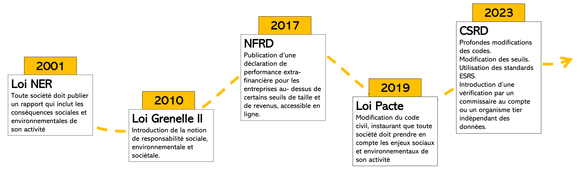

# Textes législatifs français

## Reporting extra-financier

### Articles importants

#### Code du Commerce

##### Livre II - Titre III - Article L230-1 : Tailles des entreprises [<a href = "https://www.legifrance.gouv.fr/codes/article_lc/LEGIARTI000048521044" target = "_blank">lien légisfrance</a> ]

Combiné au décret n°2023-1394 du 30 décembre 2023 (qui définit les seuils mis à jour avec CSRD), définit ce que l'on entend par micro-entreprise, petite entreprise, entreprise moyenne, grande entreprise (et pareil pour les groupes).

| Type d'entreprise  | Total du Bilan | CA Net   | Nb salariés | Critères       |
| ------------------ | -------------- | -------- | ----------- | -------------- |
| Micro-entreprise   | 350 000€       | 700 000€ | 10          | < 2/3 critères |
| Petite entreprise  | 6M€            | 12M€     | 50          | < 2/3 critères |
| Moyenne entreprise | 20M€           | 40M€     | 250         | < 2/3 critères |
| Grande entreprise  | 20M€           | 40M€     | 250         | > 2/3 critères |
| Petit groupe       | 7M€            | 14M€     | 50          | < 2/3 critères |
| Groupe moyen       | 24M€           | 48M€     | 250         | < 2/3 critères |
| Grand groupe       | 24M€           | 48M€     | 250         | > 2/3 critères |

`Total du bilan = somme des montants nets des éléments d'actifs`

`CA Net = vente de produits et services - réductions sur vente - taxe sur la valeur ajoutée - taxes assimilées`

##### Article L225-102-1 du Code du Commerce [ <a href="https://www.legifrance.gouv.fr/codes/article_lc/LEGIARTI000042339777/" target="_blank"> lien légifrance</a>]

Article qui demande aux entreprises d'insérer une déclaration extra-financière dans leur rapport pour les parties prenantes.

### Lois et décrets

#### Loi n° 2001-420 du 15 mai 2001 relative aux nouvelles régulations économiques [<a href = "https://www.legifrance.gouv.fr/loda/id/JORFTEXT000000223114/2024-01-19/" target = "_blank">lien sur legifrance</a>]

Article 116 qui modifie l'article Article L225-102-1 du code du commerce.
Ajout de la phrase :

<q>"[Le rapport annuel présenté par le conseil d'administration ou le directoire] comprend également des <b>informations</b>, dont la liste est fixée par décret en Conseil d'Etat, <b>sur la manière dont la société prend en compte les conséquences sociales et environnementales de son activité</b>."</q>

#### Loi Grenelle I -Loi n°2009-967 du 3 août 2009 de programmation relative à la mise en œuvre du Grenelle de l’environnement (1) [<a href = "https://www.legifrance.gouv.fr/loda/id/JORFTEXT000020949548" target = "_blank">lien sur legifrance</a>]

Cette loi établit des pistes d'amélioration et de travail pour approfondir la transparence quant aux conséquences sociales et environnementales de l'activité des entreprises:

- Possibilité de baisser les seuils pour que l’obligation de reporting s’applique à davantage d’entreprises.

- Possibilité d’inclure les filiales

- Pourrait comprendre des informations relatives à la contribution de l’entreprise au développement durable.
- Possibilité d’inclure les plans de formation
- Appui à la formation de labels
- Encouragement de l’investissement socialement et écologiquement responsable.
- Appui de l’ajout de critères en particulier en lien avec la biodiversité

#### Loi Grenelle II - Loi n°2010-788 du 12 juillet 2010 portant engagement national pour l’environnement [<a href = "https://www.legifrance.gouv.fr/loda/id/JORFTEXT000022470434" target = "_blank">lien sur legifrance</a>]

Les sociétés doivent également ajouter à leur rapport leurs engagements sociétaux pour le développement durable.

La loi introduit clairement la notion de responsabilité sociale des entreprises ainsi que la vérification par un organisme indépendant des infos sociales et environnementales.

#### Transposition de la NFRD (Non Financial Reporting Directive) - Ordonnance n°2017-1180 du 19 juillet 2017[<a href = "https://www.legifrance.gouv.fr/jorf/id/JORFTEXT000035250851" target = "_blank">lien sur legifrance</a>]

- Publication de déclaration de performance extra-financière quand excède une certaine taille / revenu

- Précisions sur les thèmes : changement climatique, corruption, droit de l’homme, etc

- Informations librement accessibles sur le site internet de la compagnie

#### Décret n° 2017-1265 du 9 août 2017 pris pour l'application de l'ordonnance n° 2017-1180 du 19 juillet 2017 relative à la publication d'informations non financières par certaines grandes entreprises et certains groupes d'entreprises [ <a href = "https://www.legifrance.gouv.fr/jorf/id/JORFTEXT000035401863" target="_blank"> lien legifrance </a> ]

Article 1 publie les seuils pour caractériser quelles entreprises doivent publier quoi.

| description entreprises                          | Total du bilan | CA Net | Nombre de salariés | Obligation                                            |
| ------------------------------------------------ | -------------- | ------ | ------------------ | ----------------------------------------------------- |
| toute compagnie qui dépasse CA/bilan et salariés | 20M€           | 40M€   | 500                | déclaration extra-financière dans rapport de gestion. |
| société qui établit des comptes consolidés       | 100M€          | 100M€  | 500                | déclaration extra-finanière consolidée                |

Article 2 liste les informations qui doivent être incluses dans la déclaration

- Description des <b>principaux risques</b> liés à l'activité de la société, y compris crées par ses propres relations d'affaires, produits et services
- Description des politiques, les politiques de diligence raisonnable pour prévenir, identifier et atténuer les risques
- Indicateurs clés de performance pour illustrer les résultats de ces politiques.
- Si un risque est laissé sans politique, la société doit expliquer pourquoi et justifier.
- Informations sociales

  | Thématique              | Indicateurs                                                                                                                                                     |
  | ----------------------- | --------------------------------------------------------------------------------------------------------------------------------------------------------------- |
  | Emploi                  | <ul><li>effectifs et répartition par sexe, âge et géographie</li><li>embauches et licenciements</li><li>rémunérations et leur évolution</li></ul>               |
  | Organisation du travail | <ul><li>Organisation du temps de travail</li><li>accidents de travail (fréquence, gravité, maladies professionnelles)</li></ul>                                 |
  | Relations sociales      | <ul><li>Dialogue social</li><li>Bilan des accords collectifs</li></ul>                                                                                          |
  | Formation               | <ul><li>Politique de formation sur la protection de l'environnement</li><li>nombre total d'heures de formation</li></ul>                                        |
  | Egalité des traitements | <ul><li>Mesures prises pour l'égalité H/F</li><li>Emploi et insertion des personnes handicapées</li><li>Politique de lutte contre les discriminations</li></ul> |

- Informations environnementales

| Thématique            | Indicateurs                                                                                                                                                                                                                                                                                                                  |
| --------------------- | ---------------------------------------------------------------------------------------------------------------------------------------------------------------------------------------------------------------------------------------------------------------------------------------------------------------------------- |
| Politique générale    | <ul><li>Prise en compte des questions environnementales</li><li>Démarches d'évaluation et certification</li><li>Moyens consacrés à prévention des risques et pollutions</li><li>montant des provisions et garanties\*</li></ul>                                                                                              |
| Pollution             | <ul><li>mesures de prévention, réduction ou réparation</li><li>prise en compte de toute forme de pollution spécifique à une activité (bruit, lumière)</li></ul>                                                                                                                                                              |
| Economie circulaire   | <ul><li>Mesures de prévention, recyclage, réutilisation, valorisation</li><li>actions de lutte contre le gaspillage alimentaire</li><li>consommation d'eau</li><li>consommation de matières premières</li><li>consommation d'énergie, efficacité énergétiques, énergies renouvelables</li><li>utilisation des sols</li></ul> |
| Changement climatique | <ul><li>Emissions GES</li><li>adaptation au changement climatique</li><li>objectifs de réduction des GES et moyens en oeuvre</li></ul>                                                                                                                                                                                       |
| Biodiversité          | Mesures pour préserver ou restaurer la biodiversité                                                                                                                                                                                                                                                                          |

- Informations sociétales

| Thématique                     | Indicateurs                                                                                                                                                                                          |
| ------------------------------ | ---------------------------------------------------------------------------------------------------------------------------------------------------------------------------------------------------- |
| Développement durable          | <ul><li>Impact sur l'emploi et développement local</li><li>Impact sur populations riveraines et locales</li><li>relations avec parties prenantes</li><li>actions de partenariat ou mécénat</li></ul> |
| Sous-traitance et fournisseurs | <ul><li>Prise en compte des enjeux ES dans la politique d'achats</li><li>Responsabilité ES dans relations avec fournisseurs et sous-traitants</li></ul>                                              |
| Loyauté des pratiques          | Mesures pour santé et sécurité des consommateurs                                                                                                                                                     |

- Informations complémentaires sur la lutte contre la corruption, les actions en faveur des droits de l'Homme (y compris élimination des discriminations en matière d'emploi et de profession, élimination du travail forcé ou obligatoire, élimination du travail des enfants)

Article 3 : <blockquote style="background-color:lightgrey">III.-Sans préjudice des obligations de publicité applicables au rapport prévu à l'article L. 225-100, ces déclarations sont mises à la libre disposition du public et rendues aisément accessibles sur le site internet de la société dans un délai de huit mois à compter de la clôture de l'exercice et pendant une durée de cinq années. </blockquote>

#### Loi PACTE - Loi n° 2019-486 du 22 mai 2019 relative à la croissance et la transformation des entreprises[<a href = "https://www.legifrance.gouv.fr/jorf/id/JORFTEXT000038496102/" target = "_blank">lien sur legifrance</a>]

Ajout de la phrase à l'article 1833 du code civil :

« La société est gérée dans son intérêt social, en prenant en considération les enjeux sociaux et environnementaux de son activité. »

#### CSRD - Ordonnance du 06 décembre 2023[<a href = "https://www.legifrance.gouv.fr/jorf/id/JORFTEXT000048519395" target = "_blank">lien sur legifrance</a>]

Cette ordonnance organise une refonte assez large, principalement du code du commerce, pour inclure la durabilité dans la publication annuelle des entreprises.

--> application : Décret n° 2023-1394 du 30 décembre 2023 pris en application de l'ordonnance n° 2023-1142 du 6 décembre 2023 relative à la publication et à la certification d'informations en matière de durabilité et aux obligations environnementales, sociales et de gouvernement d'entreprise des sociétés commerciales [ <a href="https://www.legifrance.gouv.fr/jorf/id/JORFTEXT000048735301" target="_blank"> lien légifrance </a>]

<a href = "https://www.legifrance.gouv.fr/jorf/article_jo/JORFARTI000048735569" target="_blank">Article 5</a> du décret détaille les informations de durabilité qui sont attendues, en particulier pour les grandes entreprises (L.232-6-3 du code du commerce). Doivent être alignées sur l'article 29ter de la directive 2013/34/UE.

## Transition énergétique et écologique

### Loi n°2021-1104 du 22 août 2021 portant lutte contre le déréglement climatique et renforcement de la résilience face à ses effets (Loi Résilience Climat) [<a href = "https://www.legifrance.gouv.fr/jorf/id/JORFTEXT000043956924"] target="\_blank"> lien légifrance</a> ]

Le but est de transitionner vers une économie bas carbone, plus résiliente, plus juste et solidaire. Comprend des mesures dans de nombreux domaines :

- Logements : gel du loyer des passoires thermiques, interdiction à la location des logements les moins bien isolés sur la base de leur DPE
- Pollution dans les villes : création de zones à faible émission (autorisées que les voitures Crit'air 1 et 2 à horizon 2025), aide pour changer de véhicule si on habite dans une ZFE, fin de vente des véhicules émettant plus de 95oCO2/km en 2030
- Interdiction des vols domestiques si alternative en train de moins de 2h30
- Education du primaire au lycée et affichage environnemental
- Encadrement de la publicité
- Moins d'emballage
- Division de l'artificialisation des sols par 2 d'ici 2030, zéro artificialisation nette en 2050, interdiction d'implanter des nouveaux centres commerciaux sur des terres naturelles ou agricoles.
- soutien aux énerfies renouvelables
- création d'un délit de mise en danger de l'environnement, délit général de pollution des milieux, délit d'écocide

#### Autres sources d'information :

<a href = "https://www.ecologie.gouv.fr/loi-climat-resilience" target="_blank">Décryptage du ministère de la transition écologique </a>

<a href = "https://www.ecologie.gouv.fr/loi-climat-et-resilience-bilan-2-ans" target="_blank"> Bilan à 2 ans du MTECT </a>

### Loi n°2016-1087 du 8 août 2016 pour la reconquête de la biodiversité, de la nature et du paysage [<a href = "https://www.legifrance.gouv.fr/jorf/id/JORFTEXT000033016237" target = "_blank">lien legifrance </a>]

<b>But affiché : </b>protéger et valoriser le patrimoine naturel français pour faire de la France le pays de l'excellence environnementale et des croissances verte et bleue.

<b> Avancées clé :</b>

<ul>
    <li>Ajout du concept de <b>réparation du préjudice écologique</b> dans l'article 4 de la loi. Demande à toute personne responsable d'un préjudice écologique de le réparer en nature autant que possible.
    <blockquote style="background-color:lightgrey">"Art. 1386-19 [du code civil].-Toute personne responsable d'un préjudice écologique est tenue de le réparer."</blockquote> </li>

    <li><b>Principe de non-regression</b> dans l'article 2<blockquote>"Le principe de non-régression, selon lequel la protection de l'environnement, assurée par les dispositions législatives et réglementaires relatives à l'environnement, ne peut faire l'objet que d'une amélioration constante, compte tenu des connaissances scientifiques et techniques du moment."</blockquote></li>

    <li><b>Principe de solidarité écologique</b> dans l'article 2<blockquote>"Le principe de solidarité écologique, qui appelle à prendre en compte, dans toute prise de décision publique ayant une incidence notable sur l'environnement des territoires concernés, les interactions des écosystèmes, des êtres vivants et des milieux naturels ou aménagés."</blockquote></li>

    <li><b>Inventaire du Patrimoine Naturel:</b> (article 7), défini comme <blockquote>inventaire du patrimoine naturel, l'inventaire des richesses écologiques, faunistiques, floristiques, géologiques, pédologiques, minéralogiques et paléontologiques.</blockquote>.
    Le texte demande la participation des maîtres d'ouvrage, publics ou privés via la saisie ou le versement de données brutes venant des études préalables.
    Les inventaires sont placés sous l'autorité du MNHN. Les données brutes sont gratuites et librement réutilisables.</li>
     
    <li>Institution dans chaque région d'un <b>conseil scientifique régional du patrimoine naturel</b>.
    </li>
     
    <li>Obligations pour construction de nouveaux bâtiments (Article 86)<blockquote style="background-color:lightgrey">I.-L'article L. 111-19 du code de l'urbanisme est complété par trois alinéas ainsi rédigés :

« Pour les projets mentionnés à l'article L. 752-1 du code de commerce, est autorisée la construction de nouveaux bâtiments uniquement s'ils intègrent :
« 1° Sur tout ou partie de leurs toitures, et de façon non exclusive, soit des procédés de production d'énergies renouvelables, soit un système de végétalisation basé sur un mode cultural garantissant un haut degré d'efficacité thermique et d'isolation et favorisant la préservation et la reconquête de la biodiversité, soit d'autres dispositifs aboutissant au même résultat ;
« 2° Sur les aires de stationnement, des revêtements de surface, des aménagements hydrauliques ou des dispositifs végétalisés favorisant la perméabilité et l'infiltration des eaux pluviales ou leur évaporation et préservant les fonctions écologiques des sols. »
II.-Le présent article s'applique aux permis de construire dont la demande a été déposée à compter du 1er mars 2017.</blockquote></li>

<li><b>Interdiction des néonicotinoïdes</b> à partir du 1er septembre 2018 (article 125)<blockquote style="background-color:lightgrey">L'utilisation de produits phytopharmaceutiques contenant une ou des substances actives de la famille des néonicotinoïdes et de semences traitées avec ces produits est interdite à compter du 1er septembre 2018.</blockquote></li>

<li>Restrictions pour l'<b>usage de plastique</b><blockquote style="background-color:lightgrey">
I.-Le III de l'article L. 541-10-5 du code de l'environnement est ainsi modifié :
1° Après le premier alinéa, sont insérés deux alinéas ainsi rédigés :
« A compter du 1er janvier 2020, la mise sur le marché des bâtonnets ouatés à usage domestique dont la tige est en plastique est interdite. Cette interdiction ne s'applique pas aux dispositifs définis aux articles L. 5211-1 et L. 5221-1 du code de la santé publique. 
« Au plus tard le 1er janvier 2018, il est mis fin à la mise sur le marché de produits cosmétiques rincés à usage d'exfoliation ou de nettoyage comportant des particules plastiques solides, à l'exception des particules d'origine naturelle non susceptibles de subsister dans les milieux, d'y propager des principes actifs chimiques ou biologiques ou d'affecter les chaînes trophiques animales. » ;</blockquote></li>

<li>Création de l'Agence Française pour la Biodiversité</li>

</ul>

##### Sources supplémentaires :

<a href = "https://www.ecologie.gouv.fr/loi-reconquete-biodiversite-nature-et-des-paysages" target="_blank">Description du Ministère de la transition écologique</a>

## Droit de l'environnement

### Protection des espèces protégées

#### Article L411-1 du code de l'environnement

#### Article L411-2 du code de l'environnement

#### Article L411-3 du code de l'environnement

### Directive Oiseaux 2009/147/CE du 30 novembre 2009

### Directive Habitats Faune et Flore 92/43/CEE du 21 mai 1992

## Droit du Travail
